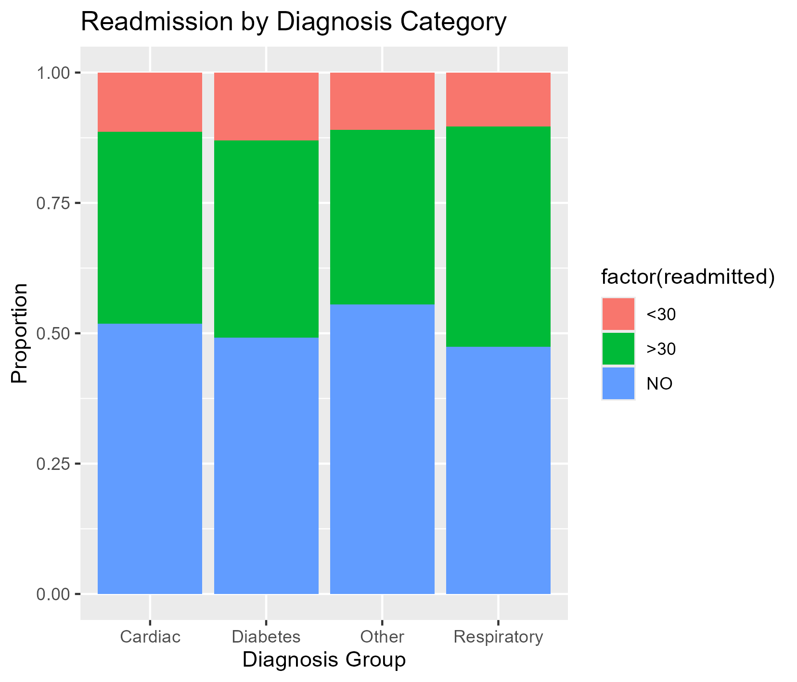

# 🏥 Hospital Readmission Risk Prediction

## 📌 Overview
This project analyzes hospital encounter data to predict 30-day patient readmission using logistic regression in R. The goal is to identify key clinical and demographic factors associated with readmission risk and build an interpretable predictive model.

---

## 📊 Dataset
- Source: Diabetes 130-US Hospitals Dataset (public healthcare dataset)
- ~100,000+ hospital encounters
- Includes patient demographics, diagnoses, medications, and utilization data
- Outcome variable: 30-day readmission status

---

## 🎯 Objective
To build a predictive model that identifies patients at higher risk of 30-day readmission and provide interpretable insights for clinical decision-making.

---

## 🧪 Methods

### Data Preparation
- Cleaned variable names using `janitor`
- Handled missing values
- Re-coded outcome variable into binary format (readmitted within 30 days)

### Feature Engineering
- Grouped primary diagnosis into clinical categories (diabetes, cardiac, respiratory, other)
- Created risk score proxy using:
  - number of medications
  - number of lab procedures
  - number of diagnoses

### Modeling
- Logistic regression model (`glm`)
- Predictors included:
  - age
  - length of hospital stay
  - medication burden
  - diagnosis category
  - risk level

---

## 📈 Model Evaluation
- Performance measured using ROC curve analysis
- AUC used to evaluate discriminatory ability of the model

## 📈 ROC Curve

The model’s performance was evaluated using a Receiver Operating Characteristic (ROC) curve, which illustrates the tradeoff between sensitivity and specificity.

---

## 🧠 Key Findings
- Higher medication burden was associated with increased readmission risk
- Longer hospital stays showed a positive relationship with readmission
- Certain diagnosis categories (cardiac and respiratory) were associated with higher risk
- Risk stratification improved interpretability of patient outcomes

---

## 📊 Visualizations
- Readmission distribution by age group
- Length of stay vs readmission
- ROC curve for model performance

---

## 🛠 Tools Used
- R
- tidyverse
- ggplot2
- pROC
- janitor

---

## 🚀 Future Improvements
- Compare logistic regression with tree-based models (Random Forest, XGBoost)
- Add cross-validation for model robustness
- Build interactive Tableau dashboard for clinical stakeholders

---

## 📌 Author
Brian Kim  
MPH Applied Biostatistics (in progress)  
Interest in healthcare analytics and sports performance data
